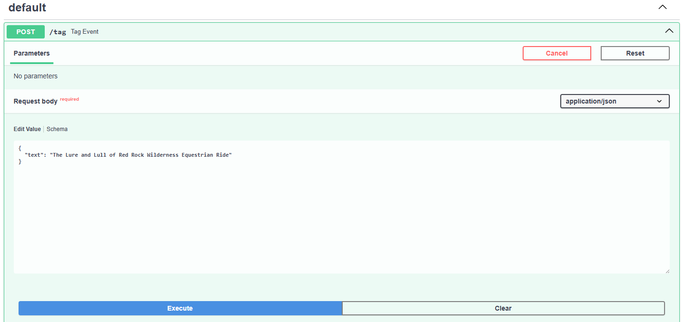
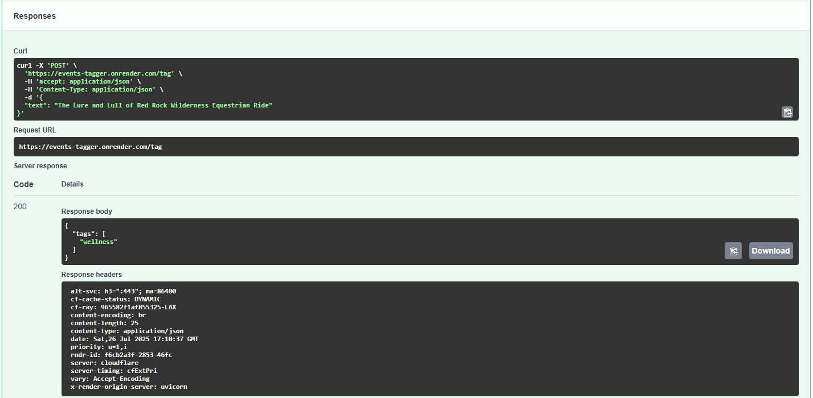

# Events Tagger
Events tagger is a classification model used for event tagging. This model was created to use for my **OC Parks Events** project in order to classify the types of events that were provided by OC Parks. 

## Demo
Check out the project here: https://events-tagger.onrender.com/docs

## Tags
_These are the tags I chose for the training model data. This is subject to change and the tags may increase down the line_
- nature
- wellness
- arts & crafts
- educational
- volunteer

Check out https://github.com/k4rni/ocparks-events to see how this model is used!

Created with 💖 by [Karnikaa Velumani](https://github.com/k4rni/).
